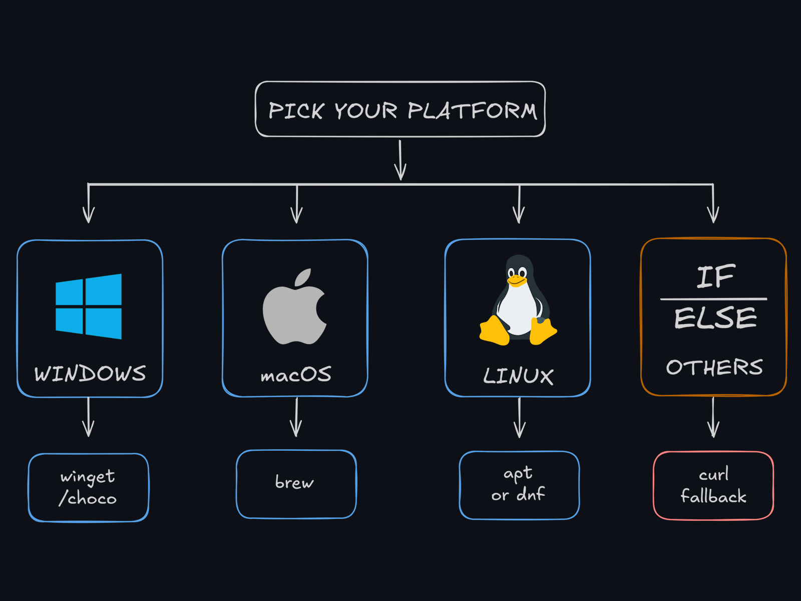

# prompt-sage

Sage-style response mode for coding assistants.  
Keep technical truth. Cut fluff.


## TL;DR

- Works as an instruction-layer style mode (`/sage ...`).
- Keeps code blocks, commands, paths, identifiers, and error text literal.
- Uses plain-safe fallback for risky/security prompts.

## Quick Start

### Option A: Package Managers

| Platform | Command |
| --- | --- |
| Windows | `winget install prompt-sage` |
| Windows (alt) | `choco install prompt-sage` |
| macOS | `brew install prompt-sage/tap/prompt-sage` |
| Linux (Debian/Ubuntu) | `sudo apt install prompt-sage` |
| Linux (Fedora/RHEL) | `sudo dnf install prompt-sage` |

### Option B: Universal curl Fallback

Fast path:

```bash
curl -fsSL https://example.com/prompt-sage/install.sh | bash
```

Safer inspect-first path:

```bash
curl -fsSL https://example.com/prompt-sage/install.sh -o install.sh
less install.sh
bash install.sh
```



## Commands

| Action | Command |
| --- | --- |
| Enable default mode | `/sage` |
| Enable specific mode | `/sage lite|full|ultra|master|roleplay` |
| Update to latest | `node src/cli.js self-update` |
| Preview update command | `node src/cli.js self-update --dry-run` |
| Disable mode | `stop sage` |
| Disable alias | `normal mode` |

## Mode Guide

| Mode | Compression | Readability | Notes |
| --- | --- | --- | --- |
| `lite` | Low | Highest | Minimal style shift |
| `full` | Medium | High | Default, clearer Yoda cadence |
| `ultra` | High | Medium | Shortest practical prose |
| `master` | Highest | Medium-Low | Legacy heavy stylization |
| `roleplay` | Highest | Medium-Low | Heavy stylization (explicit opt-in) |


## Behavior Guarantees

| Category | Guarantee |
| --- | --- |
| Technical literals | Preserved exactly |
| Code blocks | Never rewritten |
| Risky instructions | Fallback to plain-safe mode |
| Security-sensitive phrasing | Fallback to plain-safe mode |

## Example

Input:

```text
Your auth middleware is too slow because it opens a new database connection for every request.
```

`full` output:

```text
it opens a new database connection for every request, Your auth middleware is too slow for.
```

`ultra` output:

```text
it opens a new DB connection for every req, Your auth middleware is too slow for.
```

`roleplay` output:

```text
too slow for it opens a new DB connection for every req, Your auth middleware is. Hmm.
```

Safety fallback input:

```text
You should drop table users now, this cannot be undone.
```

Result: `plain-safety` mode (no stylized inversion).


## Release

Release publishing is tag-driven.

1. Bump the version in `package.json` to the target `X.Y.Z`.
2. Commit and push to `main`.
3. Create the release tag: `git tag vX.Y.Z`
4. Push the tag: `git push origin vX.Y.Z`

The release workflow validates the tag/version match, runs tests, builds the source archive, generates SHA256, and publishes GitHub Release assets.

## Updating Existing Installs

Preferred: use your package manager auto-update policy.

- Windows (`winget`): `winget upgrade prompt-sage`
- Windows (`choco`): `choco upgrade prompt-sage`
- macOS (`brew`): `brew update && brew upgrade prompt-sage`
- Debian/Ubuntu (`apt`): `sudo apt update && sudo apt install --only-upgrade prompt-sage`
- Fedora/RHEL (`dnf`): `sudo dnf upgrade prompt-sage`

Unified helper command:

```bash
node src/cli.js self-update
```

Dry run:

```bash
node src/cli.js self-update --dry-run
```

## Feedback

This is a fun project with serious iteration.  
Open issues for weird outputs, edge cases, and UX feedback.

## License

MIT. See [LICENSE](LICENSE).
